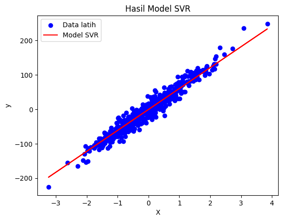

# Belajar Support Vector Regression dengan Python dan Scikit-learn

## 1. Pengenalan Support Vector Regression

Support Vector Regression (SVR) merupakan salah satu algoritma machine learning yang merupakan bagian dari Support Vector Machine. SVR ini salah satu model yang digunakan untuk kasus regresi.

Kalau begitu, apa yang membedakannya dengan linear regression? Yang membedakannya adalah bahwa SVR cenderung lebih tahan terhadap outlier, sedangkan linear regression tidak. Selain itu, SVR juga dapat menangani kasus di mana jika data $$X$$ tidak linear, dengan sesuatu yang dikenal sebagai kernel trick.

Apa itu kernel trick? Gampangnya adalah, kalau misalnya kita memiliki data yang tidak linear, dengan kernel trick ini si SVR dapat memetakan datanya ke dimensi yang lebih tinggi. Sehingga, data yang diubah ke dimensi yang lebih tinggi itulah nantinya akan terlihat linear di ruang yang baru.

## 2. Pengenalan ```make_regression()```

Pada kasus ini, kita akan memanfaatkan sebuah method dari Scikit-learn untuk membuat data sintetis. Sederhananya, daripada kita susah payah mencari data di internet, kita dapat menggunakan method yang disebut ```make_regression()```. Method ini juga akan mengembalikan dua variabel, yaitu $$X$$ dan $$y$$.

Nah, ```make_regression()``` ini akan menerima beberapa parameter penting, yaitu:

1. ```n_samples```, di mana ini adalah parameter untuk menentukan seberapa banyak jumlah data (baris) yang diinginkan. Jika ```n_samples=500```, maka akan ada 500 baris data yang tercipta.
2. ```n_features```, merupakan parameter untuk menentukan jumlah fitur $$X$$ atau jumlah kolomnya. Jika ```n_features=5```, maka akan ada 5 fitur $$X$$ yang tercipta.
3. ```n_informative```, adalah parameter untuk menentukan seberapa banyak fitur yang telah ada akan berpengaruh besar. Misalnya, jika tadi sudah ada 5 kolom, lalu kita set ```n_informative=2```, maka ada 5 kolom tersebut yang paling berpengaruh/berkontribusi besar adalah 2 kolom saja.
4. ```noise```, adalah parameter gangguan. Jika parameter ini digunakan, maka yang tadi datanya akan 100% linear, dengan noise ini kita dapat membuatnya tidak terlalu linear.
5. ```random_state```, sebenarnya parameter ini opsional, di mana parameter ini digunakan untuk menentukan kekonsistenan. Kalau misalnya saya set ```random_state=42```, maka data yang dihasilkan akan sama di komputer mana pun itu, selama nilainya 42. Nilainya juga bebas, tidak selalu 42.

## 3. Penerapan Model SVR dengan Python dan Scikit-learn

1. Pada langkah pertama, kita akan melakukan import terhadap library yang dibutuhkan.
```
# Import Library yang diperlukan
import matplotlib.pyplot as plt
from sklearn.datasets import make_regression
from sklearn.svm import SVR
from sklearn.metrics import r2_score
```
<br>
Karena ini adalah kasus regresi, maka metrik yang akan digunakan adalah $$R^2$$ Score.

2. Selanjutnya, kita akan membuat data sintetis dengan ```make_regression()```. Untuk kali ini, kita hanya akan membuat dengan 1 fitur supaya dapat di-plot.
```
# Membuat data sintetis dengan method make_regression()
X, y = make_regression(
    n_samples=500,
    n_features=1,
    noise=15,
    random_state=42
)
```

3. Karena data sudah ada, selanjutnya kita akan membuat modelnya dan melatihnya. Nah, secara default, kernel dari model SVR ini adalah ```rbf```, tetapi kita bisa mengubahnya menjadi ```linear```.
```
# Membuat model SVR
model = SVR(kernel='linear')

# Melatih model SVR
model.fit(X, y)
```

4. Selanjutnya, kita dapat memperoleh akurasinya dengan terlebih dahulu memprediksi nilai $$X$$, lalu membandingkan hasil prediksi dengan nilai $$y$$ aslinya.
```
# Memprediksi nilai X awal
y_pred = model.predict(X)

# Mendapatkan akurasi
r2 = r2_score(y, y_pred)

print(f'Akurasi Model: {r2}')
```

5. Kalian juga bisa membuat plotting dari hasil modelnya.
```
plt.scatter(X, y, color='blue', label='Data latih')
plt.plot(X, y_pred, color='red', label='Model SVR')
plt.title('Hasil Model SVR')
plt.xlabel('X')
plt.ylabel('y')
plt.legend()
plt.show()
```
<br>

Berikut adalah kode program lengkapnya:
```
# Import Library yang diperlukan
import matplotlib.pyplot as plt
from sklearn.datasets import make_regression
from sklearn.svm import SVR
from sklearn.metrics import r2_score

# Membuat data sintetis dengan method make_regression()
X, y = make_regression(
    n_samples=500,
    n_features=1,
    noise=15,
    random_state=42
)

# Membuat model SVR
model = SVR(kernel='linear')

# Melatih model SVR
model.fit(X, y)

# Memprediksi nilai X awal
y_pred = model.predict(X)

# Mendapatkan akurasi
r2 = r2_score(y, y_pred)

print(f'Akurasi Model: {r2}')

plt.scatter(X, y, color='blue', label='Data latih')
plt.plot(X, y_pred, color='red', label='Model SVR')
plt.title('Hasil Model SVR')
plt.xlabel('X')
plt.ylabel('y')
plt.legend()
plt.show()
```

## 3. Hasil Plot

Berikut adalah hasil plotting-nya:




