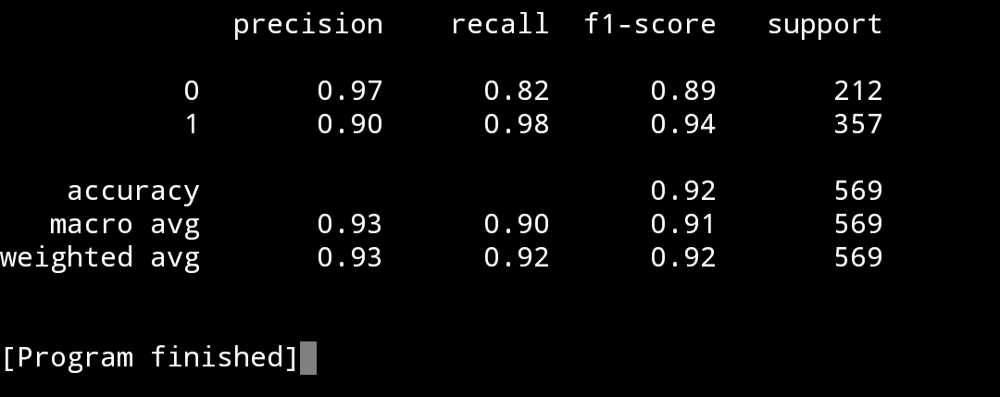

# Belajar Support Vector Classification dengan Python dan Scikit-learn

## 1. Pengenalan Support Vector Classification (SVC)

Support Vector Classification atau SVC adalah salah satu algoritma machine learning yang termasuk ke dalam keluarga Support Vector Machine. Nah, bedanya dengan SVR adalah bahwa SVC digunakan untuk kasus klasifikasi. Misalnya, klasifikasi biner maupun klasifikasi multikelas.

Bagaimana caranya SVC bekerja? Pada intinya, SVC akan mencoba untuk menciptakan sesuatu yang disebut dengan garis pemisah atau hyperplane yang paling optimal untuk memisahkan antara dua kelas atau lebih.

## 2. Penerapan SVC dengan Python dan Scikit-learn

Pada penerapan kali ini, kita akan menggunakan dataset bawaan atau dataset yang sudah disediakan secara gratis oleh Scikit-learn. Dataset ini berisikan informasi mengenai penyakit diabetes, yang di mana target dari dataset ini ada 2 label, yaitu 0 (malignant/ganas) dan 1 (benign/jinak).

1. Pada tahap pertama, kita akan seperti biasanya import library yang diperlukan.
```
# Import Library yang diperlukan
import matplotlib.pyplot as plt
from sklearn.datasets import load_breast_cancer
from sklearn.svm import SVC
from sklearn.metrics import classification_report
```
<br>

Pada salah satu baris import tersebut, kita akan menggunakan alat bantu bernama ```classification_report()```. Nantinya, method ini akan mengembalikan seluruh metrik yang diperlukan, dari mulai Precision, F1-Score, Recall, dan lain-lain.

2. Langkah kedua, kita akan memuat dataset-nya dari Scikit-learn dan memisahkan variabel $$X$$ (feature) dan $$y$$ (target).
```
# Memuat dataset diabetes dari Scikit-learn
cancer = load_breast_cancer()

# Memisahkan variabel X (feature) dan y (target)
X = cancer.data
y = cancer.target # 0 untuk 'malignant' (ganas) dan 1 untuk 'benign' (jinak)
```

3. Langkah ketiga, kita akan membuat model SVC-nya. Nah, perlu diketahui bahwa SVC juga memiliki beberapa parameter penting, dua di antaranya yaitu ```kernel``` dan ```C```. Untuk sekarang, kita akan biarkan setting-annya default dulu.
```
# Membuat model SVC
model = SVC()

# Melatih model SVC
model.fit(X, y)
```

4. Langkah terakhir, kita akan menghitung akurasinya dengan ```classification_report()```, di mana method ini akan mengembalikan berbagai macam akurasi. Sehingga, kalian tidak terpatok di satu jenis akurasi saja. Caranya sama, kalian harus terlebih dahulu memprediksi nilai feature dengan model yang telah dilatih, barulah membandingkannya dengan target yang asli.
```
# Mendapatkan terlebih dahulu report-nya
y_pred = model.predict(X)
report = classification_report(y, y_pred)

# Menampilkan classification_report
print(report)
```
<br>

Berikut adalah kode program lengkapnya:
```
# Import Library yang diperlukan
from sklearn.datasets import load_breast_cancer
from sklearn.svm import SVC
from sklearn.metrics import classification_report

# Memuat dataset diabetes dari Scikit-learn
cancer = load_breast_cancer()

# Memisahkan variabel X (feature) dan y (target)
X = cancer.data
y = cancer.target # 0 untuk 'malignant' (ganas) dan 1 untuk 'benign' (jinak)

# Membuat model SVC
model = SVC()

# Melatih model SVC
model.fit(X, y)

# Mendapatkan terlebih dahulu report-nya
y_pred = model.predict(X)
report = classification_report(y, y_pred)

# Menampilkan classification_report
print(report)
```

## 3. Hasil Plot

Jika kalian melakukannya dengan benar, akan tampil report-nya seperti berikut:




