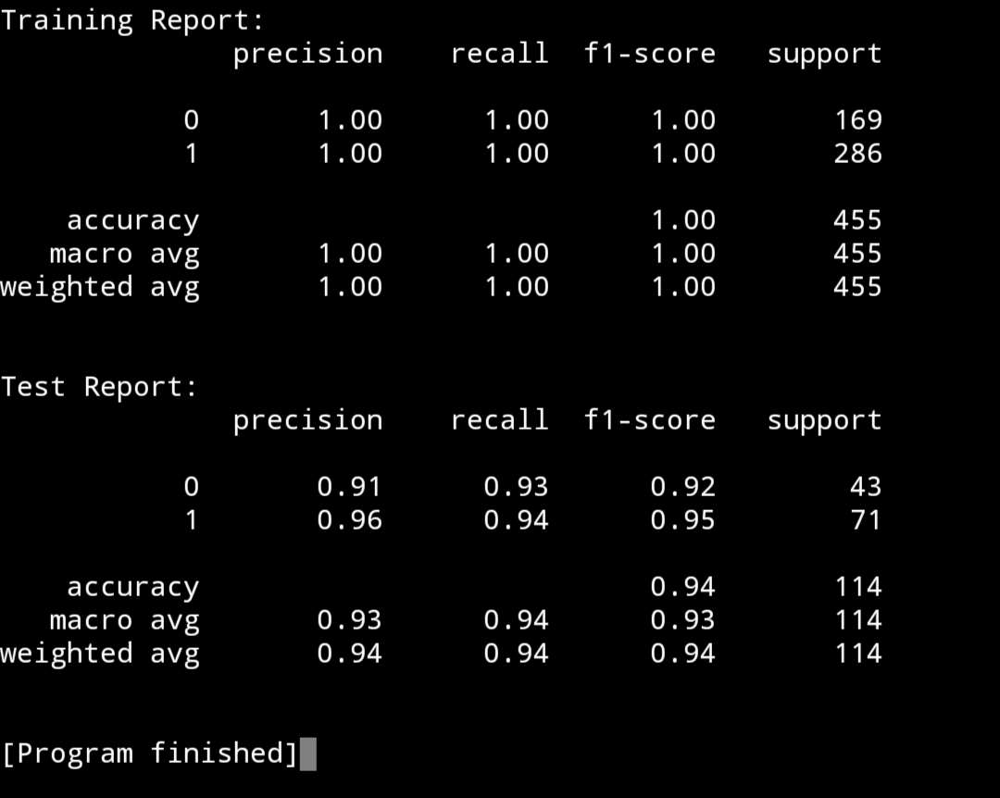
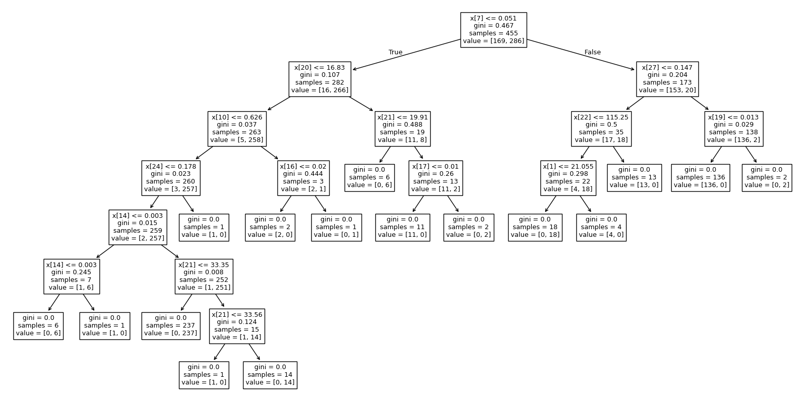

# Belajar Decision Tree Classifier dengan Python dan Scikit-learn

## 1. Pengenalan Decision Tree Classifier

Decision Tree Classifier adalah salah satu algoritma machine learning yang cara bekerjanya adalah dengan berbasis pohon keputusan. Gampangnya begini, anggaplah Decision Tree Classifier ini adalah program IF-ELSE berantai, yang cabangnya dapat memiliki cabang lagi. Perhatikan ilustrasi kode program berikut:

```
age = 18
has_id_card = False

if age >= 18 and has_id_card == True:
    print('Welcome to the Club!')
else:
    print('You are not allowed to enter the Club.')
```
<br>

Nah, DTC ini juga cara pengerjaannya mirip-mirip dengan skema IF-ELSE tersebut. Bedanya, DTC ini berbasis perhitungan matematis, seperti Gini Impurity, Information Gain, dan Reduction in Variance. DTC ini juga mampu menangkap pola yang terbilang nonlinear dan juga mampu menangkap pola dari puluhan feature hingga ribuan baris data.

Pada akhirnya, ketika model sudah selesai dalam proses training, ia dapat dibuat juga skema IF-ELSE-nya dalam bentuk visual. Sehingga, dapat dengan mudah terbayang bagaimana cara kerjanya.

Pada model DTC ini, terdapat beberapa parameter penting yang perlu diketahui, yaitu: ```criterion```, ```max_depth```, ```min_samples_split```, ```min_samples_leaf```, ```max_features```, dan ```random_state```.

Saya tidak akan memberikan detail mengenai parameter-parameternya, tetapi yang pasti, kita bisa cukup fokus pada ```max_depth``` saja, di mana parameter ini akan menentukan kedalaman pohonnya. Secara default, nilainya adalah ```None```, namun kita bisa mengaturnya jika akurasi dari model yang dihasilkan kurang baik.

## 2. Pengenalan ```train_test_split()```

```train_test_split()``` merupakan sebuah method yang ada di Scikit-learn, di mana ia berfungsi untuk memisahkan dataset kita menjadi data latih (training set) dan data uji (test set). Method ini akan mengembalikan 4 variabel, yaitu ```X_train```, ```X_test```, ```y_train```, dan ```y_test```.

Method ini memiliki 2 parameter penting yang perlu diisi, yaitu dataset-nya dan ```test_size```. ```test_size``` adalah parameter untuk menentukan ukuran data ujinya. Umumnya bisa memakai format 70–30 (70% training dan 30 testing), 60–40 (60% training dan 40% testing), atau 80–20 (80% training dan 20% testing, yang saya sarankan).

Lalu, apa kegunaan method ini? Method ini sangat berguna untuk membandingkan antara data latih dengan data uji. Kalau misalnya:

1. Akurasi training > Akurasi testing, maka model dinyatakan overfitting, atau model bagus dalam data latih tapi buruk pada data uji.
2. Akurasi training dan Akurasi testing sama-sama <= 60%, besar kemungkinan modelnya underfitting, atau model sama sekali buruk dalam data latih maupun data uji.

## 3. Penerapan Decision Tree Classifier dengan Python dan Scikit-learn 

Pada kasus ini, kita tetap akan menggunakan dataset dari kasus sebelumnya, yaitu dataset kanker payudara.

1. Pada langkah pertama, seperti biasa kita akan import library yang diperlukan.
```
# Import Library yang diperlukan
from sklearn.datasets import load_breast_cancer
from sklearn.model_selection import train_test_split
from sklearn.tree import DecisionTreeClassifier
from sklearn.metrics import classification_report
```

2. Langkah kedua, kita akan memuat dataset-nya dan membaginya untuk data latih (training) dan data uji (testing).
```
# Memuat dataset bawaan
cancer = load_breast_cancer()

# Memisah feature dan target
X = cancer.data
y = cancer.target

# Pemisahan data uji dan data latih
X_train, X_test, y_train, y_test = train_test_split(X, y, test_size=0.2, random_state=42) # 20% ditulis sebagai 0.2
```

3. Langkah ketiga, kita akan membuat modelnya dan melatihnya terlebih dahulu dengan data training.
```
# Pembuatan model Decision Tree Classifier
model = DecisionTreeClassifier()

# Melatih model dengan data uji
model.fit(X_train, y_train)
```

4. Langkah keempat, untuk mengetahui apakah model overfitting atau underfitting, kita harus membuat prediksi terhadap data latih dan juga data uji. Sehingga, nanti dapat dibuat ```classification_report()``` untuk data uji dan data latih.
```
# Mengukur akurasi model untuk data uji dan data latih
y_train_pred = model.predict(X_train)
y_test_pred = model.predict(X_test)

# Classification Report untuk data latih
train_report = classification_report(y_train, y_train_pred)

# Classification Report untuk data uji
test_report = classification_report(y_test, y_test_pred)
```

5. Langkah kelima, kita akan menampilkan report dari kedua uji.
```
# Menampilkan kedua report
print(f'Training Report:\n{train_report}')
print()
print(f'Test Report:\n{test_report}')
```

6. Langkah terakhir, kalian bisa menampilkan visualisasi Decision Tree Classifier-nya dengan method ```plot_tree()```.
```
# Menampilkan visualisasi model
plt.figure(figsize=(20, 10))
plot_tree(model)
plt.show()
```
<br>

Dengan begitu, kalian akan mendapatkan output sebagai berikut:





