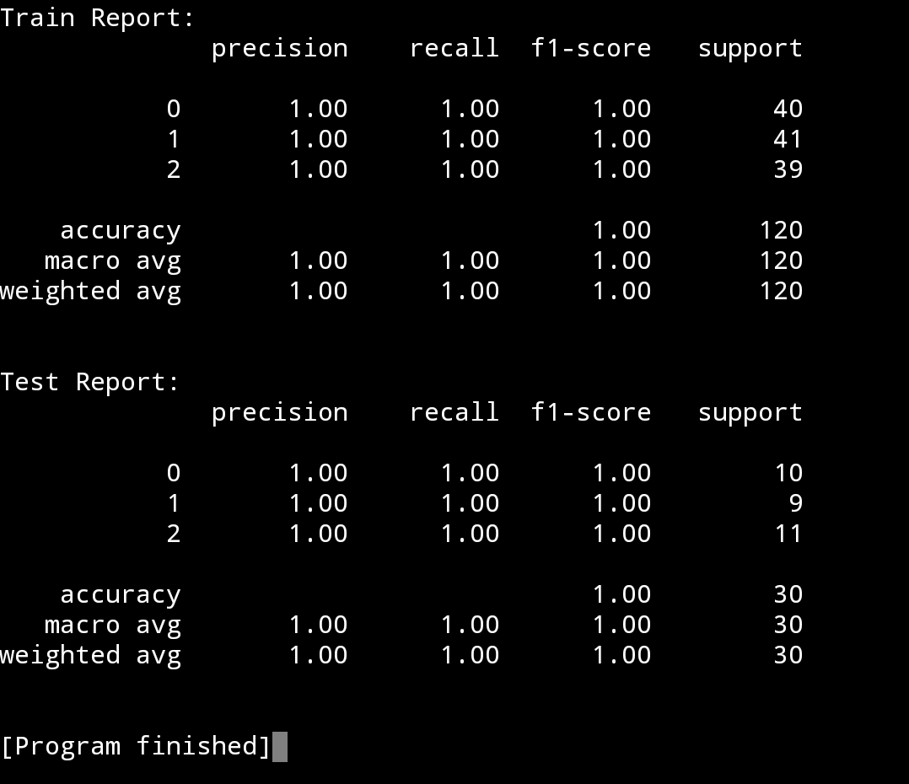

# Belajar Random Forest Classifier dengan Python dan Scikit-learn

## 1. Pengenalan Random Forest Classifier

Random Forest Classifier merupakan salah satu algoritma machine learning yang digunakan untuk kasus klasifikasi, di mana Random Forest ini bekerja dengan menciptakan berbagai macam pohon keputusan (Decision Tree) dengan akurasi yang lemah, lalu menggabungkan mereka semua untuk menghasilkan akurasi yang lebih baik. Gampangnya, seperti Decision Tree tetapi versi lanjutnya.

Random Forest ini juga memiliki parameter-parameter yang serupa dengan Decision Tree, seperti: ```criterion```, ```max_depth```, ```min_samples_split```, ```min_samples_leaf```, ```max_features```, dan ```random_state```. Namun, pada kali ini kita hanya akan mengandalkan parameter bawaannya saja (default parameter/baseline model).

## 2. Penerapan Random Forest Classifier dengan Python dan Scikit-learn

Pada kasus ini, dataset yang kita akan gunakan adalah dataset bunga Iris, di mana dataset ini berisikan informasi seperti: ```sepal_length```, ```sepal_width```, ```petal_length```, dan ```petal_width```. Untuk informasi lebih lengkapnya, silakan kunjungi website [ini](https://share.google/CPszoLV4nK9LILyHK).

1. Seperti biasa, pada tahap ini kita akan import beberapa module yang diperlukan.
```
# Import Library yang diperlukan
from sklearn.datasets import load_iris
from sklearn.model_selection import train_test_split
from sklearn.ensemble import RandomForestClassifier
from sklearn.metrics import classification_report
```

2. Lalu, pada tahap kedua kita akan memuat dataset bunga Iris dan memisah fitur dan targetnya.
```
# Memuat dataset
iris = load_iris()

# Memisah fitur dan target
X = iris.data
y = iris.target
```

3. Selanjutnya, kita akan membuat data latih dan data uji yang berasal dari pemisahan fitur dan target tersebut.
```
# Membuat data latih dan data uji dari fitur dan target awal
X_train, X_test, y_train, y_test = train_test_split(X, y, train_size=0.8, test_size=0.2, random_state=42)
```

4. Langkah keempat, kita akan membuat model Random Forest, sekaligus melatihnya dengan data latih yang sudah kita buat.
```
# Membuat model
model = RandomForestClassifier()

# Melatih model dengan data latih
model.fit(X_train, y_train)
```

5. Untuk mendapatkan akurasi dari model yang telah dilatih, kita perlu menggunakan model kita untuk melakukan memprediksi terhadap data latih (```X_train```) dan data uji (```X_test```). Lalu, nanti hasil prediksinya (```y_train_pred```/```y_test_pred```) akan dibandingkan dengan data target yang asli (```y_train```/```y_test```).
```
# Memprediksi data latih dan data uji
y_train_pred = model.predict(X_train)
y_test_pred = model.predict(X_test)

# Mendapatkan akurasi untuk data latih dan data uji
train_report = classification_report(y_train, y_train_pred)
test_report = classification_report(y_test, y_test_pred)
```

6. Langkah terakhir, kita akan menampilkan hasilnya report-nya dengan ```classification_report()```.
```
# Menampilkan report
print(f'Train Report:\n{train_report}')
print()
print(f'Test Report:\n{test_report}')
```
<br>

Berikut adalah kode program lengkapnya:
```
# Import Library yang diperlukan
from sklearn.datasets import load_iris
from sklearn.model_selection import train_test_split
from sklearn.ensemble import RandomForestClassifier
from sklearn.metrics import classification_report

# Memuat dataset
iris = load_iris()

# Memisah fitur dan target
X = iris.data
y = iris.target

# Membuat data latih dan data uji dari fitur dan target awal
X_train, X_test, y_train, y_test = train_test_split(X, y, train_size=0.8, test_size=0.2, random_state=42)

# Membuat model
model = RandomForestClassifier()

# Melatih model dengan data latih
model.fit(X_train, y_train)

# Memprediksi data latih dan data uji
y_train_pred = model.predict(X_train)
y_test_pred = model.predict(X_test)

# Mendapatkan akurasi untuk data latih dan data uji
train_report = classification_report(y_train, y_train_pred)
test_report = classification_report(y_test, y_test_pred)

# Menampilkan report
print(f'Train Report:\n{train_report}')
print()
print(f'Test Report:\n{test_report}')
```
<br>

Jika kalian mengikuti persis kode program tersebut, maka akan menampilkan report seperti berikut:




