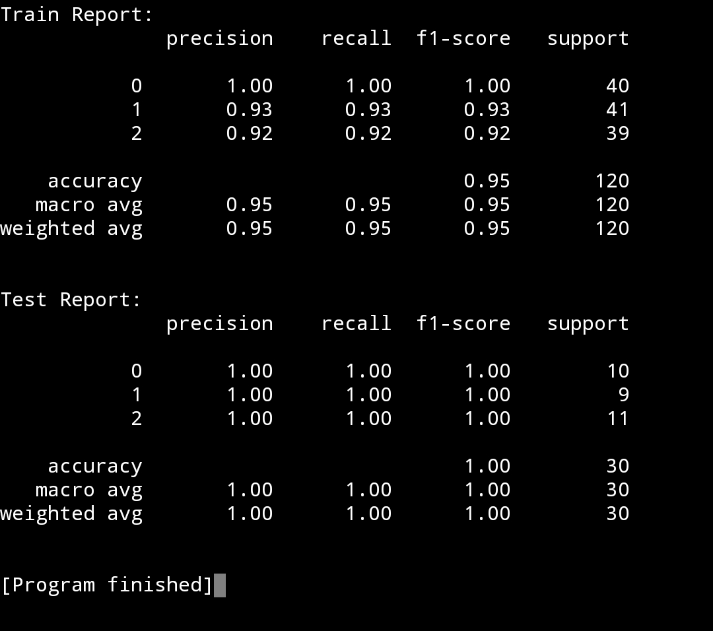

# Belajar Naive Bayes dengan Python dan Scikit-learn

## 1. Pengenalan Naive Bayes

Naive Bayes merupakan salah satu algoritma machine learning yang digunakan untuk masalah klasifiikasi, di mana algoritma ini melakukan perhitungannya berdasarkan teori probabilitas. Dalam menghitung probabilitas, algoritma ini akan menerapkan Teorema Bayes dalam mengklasifikasikan kelas tertentu untuk suatu data.

Sebelum menerapkan algoritma ini, perlu diketahui ada beberapa jenis algoritma Naive Bayes yang ada pada module Scikit-learn, yaitu:

1. **Gaussian Naive Bayes**: digunakan untuk data kontinu dengan asumsi distribusi normal (Gaussian). Contoh: memprediksi apakah tumor jinak atau ganas berdasarkan ukuran dan atribut lainnya.
2. **Multinomial Naive Bayes**: digunakan untuk data diskrit, seperti jumlah kata dalam teks. Contoh: deteksi spam berdasarkan frekuensi kata.
3. **Bernoulli Naive Bayes**: digunakan untuk data biner (0/1 atau Ya/Tidak). Contoh: klasifikasi teks dengan fitur biner (keberadaan atau ketiadaan kata).
4. **Complement Naive Bayes**: variasi dari Multinomial Naive Bayes yang lebih stabil dan efektif untuk data tidak seimbang.

Untuk kasus ini, kita akan menerapkan algoritma pertama, yaitu Gaussian Naive Bayes, karena merupakan algoritma Naive Bayes yang sederhana.

## 2. Penerapan Naive Bayes dengan Python dan Scikit-learn

Untuk menerapkan algoritma ini, kita akan menggunakan data Iris lagi, karena dataset-nya tergolong sederhana.

1. Tahap pertama, kita akan melakukan import terhadap library yang diperlukan.
```
# Import Library yang diperlukan
from sklearn.datasets import load_iris
from sklearn.model_selection import train_test_split
from sklearn.naive_bayes import GaussianNB
from sklearn.metrics import classification_report
```

2. Tahap kedua, kita akan memuat dataset-nya dari Scikit-learn, lalu akan memisahkan data fitur dan data targetnya.
```
# Memuat dataset
iris = load_iris()

# Memisah fitur dan target
X = iris.data
y = iris.target
```

3. Tahap ketiga, kita akan memisahkan data latih dan data ujinya, yang nantinya akan digunakan untuk membandingkan akurasi data latih dengan data uji.
```
# Membuat data latih dan data uji dari fitur dan target awal
X_train, X_test, y_train, y_test = train_test_split(X, y, train_size=0.8, test_size=0.2, random_state=42)
```

4. Langkah keempat, kita akan membuat model Naive Bayes, sekaligus melatihnya dengan data latih yang sudah kita buat.
```
# Membuat model
model = GaussianNB()

# Melatih model dengan data latih
model.fit(X_train, y_train)
```

5. Untuk mendapatkan akurasi dari model yang telah dilatih, kita perlu menggunakan model kita untuk melakukan memprediksi terhadap data latih (```X_train```) dan data uji (```X_test```). Lalu, nanti hasil prediksinya (```y_train_pred```/```y_test_pred```) akan dibandingkan dengan data target yang asli (```y_train```/```y_test```).
```
# Mendapatkan akurasi untuk data latih dan data uji
train_report = classification_report(y_train, y_train_pred)
test_report = classification_report(y_test, y_test_pred)
```

6. Langkah terakhir, kita akan menampilkan hasilnya report-nya dengan ```classification_report()```.
```
# Mendapatkan akurasi untuk data latih dan data uji
train_report = classification_report(y_train, y_train_pred)
test_report = classification_report(y_test, y_test_pred)
```
<br>

Berikut adalah kode program lengkapnya:
```
# Import Library yang diperlukan
from sklearn.datasets import load_iris
from sklearn.model_selection import train_test_split
from sklearn.naive_bayes import GaussianNB
from sklearn.metrics import classification_report

# Memuat dataset
iris = load_iris()

# Memisah fitur dan target
X = iris.data
y = iris.target

# Membuat data latih dan data uji dari fitur dan target awal
X_train, X_test, y_train, y_test = train_test_split(X, y, train_size=0.8, test_size=0.2, random_state=42)

# Membuat model
model = GaussianNB()

# Melatih model dengan data latih
model.fit(X_train, y_train)

# Memprediksi data latih dan data uji
y_train_pred = model.predict(X_train)
y_test_pred = model.predict(X_test)

# Mendapatkan akurasi untuk data latih dan data uji
train_report = classification_report(y_train, y_train_pred)
test_report = classification_report(y_test, y_test_pred)

# Menampilkan report
print(f'Train Report:\n{train_report}')
print()
print(f'Test Report:\n{test_report}')
```

Jika kalian mengikuti persis seperti kode program di atas, maka akan menampilkan output sebagai berikut:




