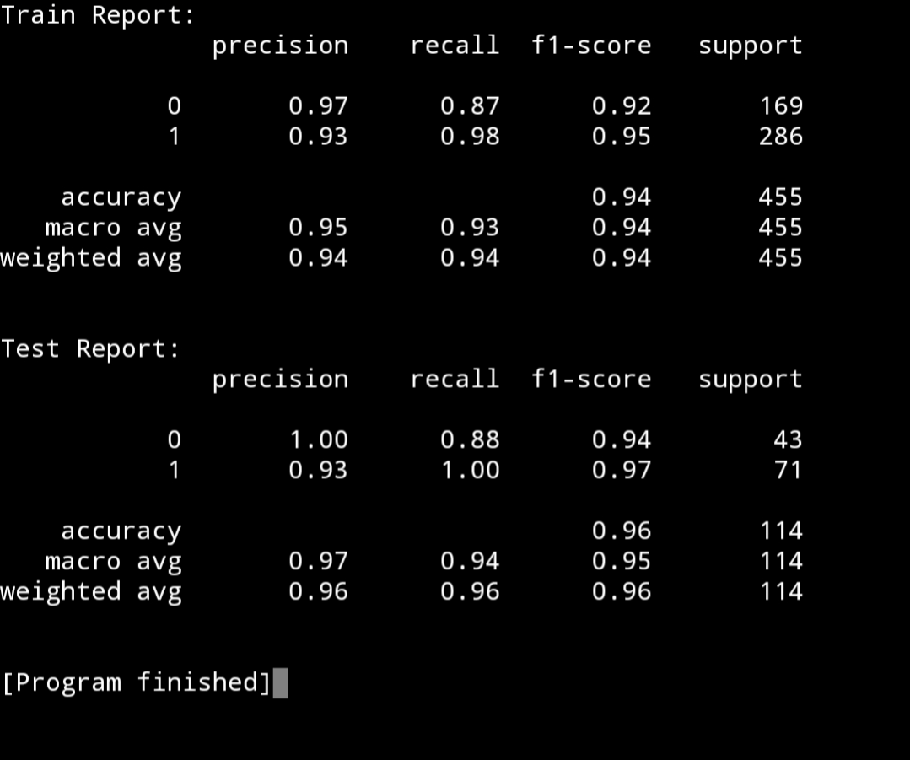

# Belajar K-Nearest Neighbors Classification dengan Python dan Scikit-learn

## 1. Pengenalan K-Nearest Neighbors

K-Nearest Neighbors (KNN) merupakan salah satu algoritma machine learning yang umum digunakan untuk kasus klasifikasi, di mana model KNN ini akan mencocokkan variabel fitur dengan tetangga di sekitarnya. Bayangkan kamu ingin menentukan apakah restoran baru di dekat rumah itu termasuk restoran mahal atau restoran murah. Kamu tidak tahu langsung, jadi kamu membandingkannya dengan beberapa restoran lain yang paling mirip dan paling dekat (misalnya dari lokasi atau menu). Jika dari 5 restoran terdekat, 4 di antaranya adalah restoran murah, maka kamu menyimpulkan restoran baru ini kemungkinan besar juga murah. Itulah cara kerja KNN: mengambil keputusan berdasarkan k tetangga terdekat.

Pada Scikit-learn, algoritma ini memiliki satu parameter penting yang wajib diketahui, yaitu ```n_neighbors```. Parameter ini akan menentukan seberapa ketat penentuan kelasnya. Jika dalam satu jangkaun terdapat 2 titik data dari kelas A dan 5 titik data dari kelas B, maka otomatis modelnya akan memilih kelas B sebagai pilihan prediksinya.

## 2. Penerapan K-Nearest Neighbors dengan Python dan Scikit-learn

Pada kasus ini, kita akan menggunakan dataset Wisconsin Breast Cancer, yaitu dataset yang membahas mengenai kanker payudara. Tujuan kita adalah membuat model yang dapat memprediksi apakah seseorang terkena kanker payudara berdasarkan data-data (fitur) medis yang ada.

1. Langkah pertama, kita akan melakukan import terhadap module yang diperlukan (seperti biasa 😁).
```
# Import Library yang diperlukan
from sklearn.datasets import load_breast_cancer
from sklearn.model_selection import train_test_split
from sklearn.neighbors import KNeighborsClassifier
from sklearn.metrics import classification_report
```

2. Langkah kedua, kita akan memuat dataset kanker payudaranya, memisah fitur dengan targetnya, dan membaginya ke dalam data latih (```X_train```/```y_train```) dan data uji (```X_test```/```y_test```).
```
# Memuat dataset
cancer = load_breast_cancer()

# Memisah fitur dan target
X = cancer.data
y = cancer.target

# Membuat data latih dan data uji dari fitur dan target awal
X_train, X_test, y_train, y_test = train_test_split(X, y, train_size=0.8, test_size=0.2, random_state=42)
```

3. Langkah ketiga, kita masuk ke proses pembuatan model KNN-nya dan melatihnya.
```
# Membuat model
model = KNeighborsClassifier() # Secara default, parameter n_neighbors bernilai 5

# Melatih model dengan data latih
model.fit(X_train, y_train)
```

4. Langkah keempat, untuk mendapatkan performa dari model, kita akan membuat prediksi terhadap data latih dan data uji, lalu membandingkannya apakah terdapat perbedaan akurasi yang signifikan atau tidak. Jika ya, maka model cenderung overfitting, dan jika tidak, maka selamat! Model yang dibuat sudah pas!
```
# Memprediksi data latih dan data uji
y_train_pred = model.predict(X_train)
y_test_pred = model.predict(X_test)
```

5. Langkah terakhir, kita akan membandingkan data target asli dengan data target yang diprediksi oleh model. Dengan begitu, kita dapat mengetahui performa sesungguhnya dari model KNN tersebut.
```
# Mendapatkan akurasi untuk data latih dan data uji
train_report = classification_report(y_train, y_train_pred)
test_report = classification_report(y_test, y_test_pred)

# Menampilkan report
print(f'Train Report:\n{train_report}')
print()
print(f'Test Report:\n{test_report}')
```
<br>

Dari Classification Report tersebut, akan menampilkan informasi sebagai berikut:



Dari informasi tersebut, dapat diketahui nilai Accuracy pada Train Report adalah sebesar 0,94 (alias sangatlah bagus akurasinya) dan nilai Accuracy pada Test Report sebesar 0,96. Dari sini, dapat diketahui bahwa tidak terdapat perbedaan akurasi yang signifikan. Sehingga, model dianggap sudah sangat baik dalam melakukan klasifikasi.


